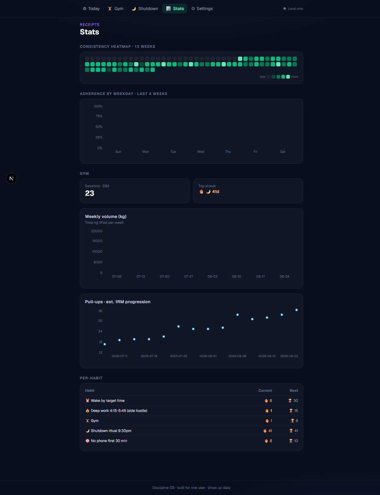
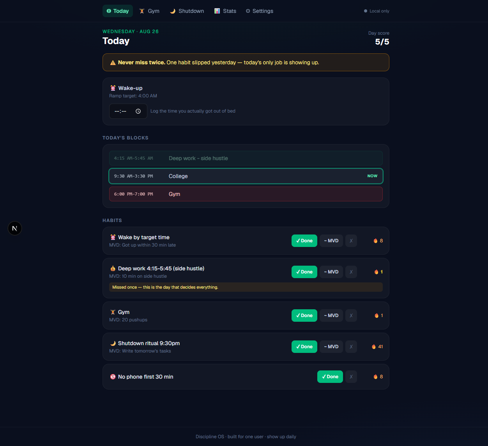
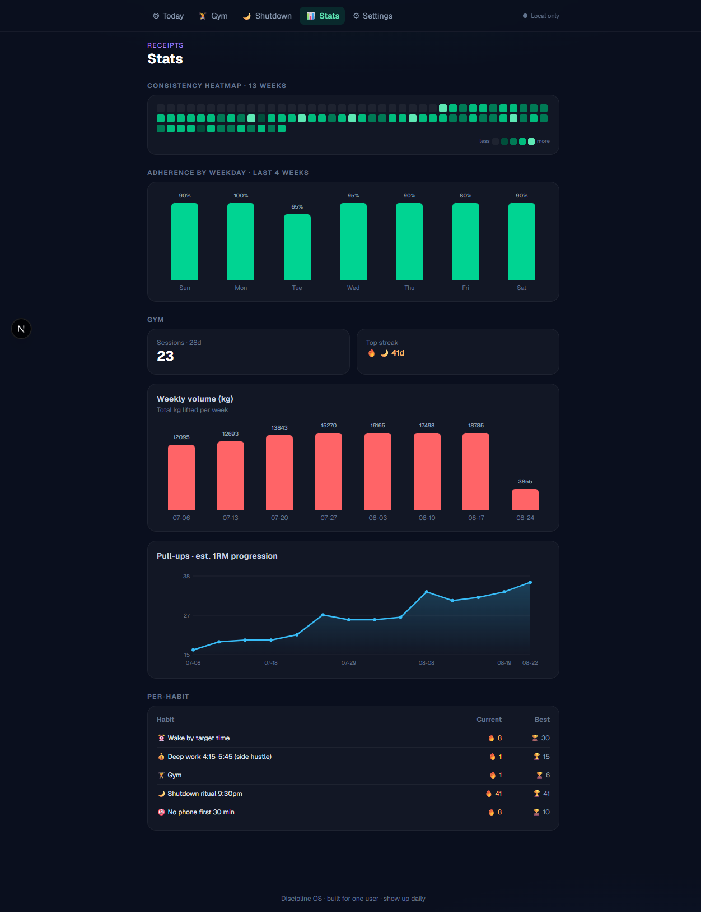

<div align="center">


# 🏛️ Discipline OS

**A personal consistency operating system — built for one user, designed around a real college timetable, a 4 AM routine, and the rule that wins everything:**

### _never miss twice._

[](https://nextjs.org)
[](https://react.dev)
[](https://typescriptlang.org)
[](https://tailwindcss.com)
[](https://supabase.com)
[](https://developer.mozilla.org/en-US/docs/Web/Progressive_web_apps)
[](https://github.com/kotasuryanirupam/discipline-os/actions/workflows/ci.yml)
[](LICENSE)

[**→ Try the live app**](https://discipline-os-blond.vercel.app)

</div>

---

## 📸 Screenshots

| Today | Gym | Stats |
| :---: | :---: | :---: |
|  |  |  |
| Day score, wake target, schedule blocks, habit streaks | Wed-anchored split, fast set logging, PR detection | 13-week heatmap, adherence, volume & 1RM progression |

## ✨ Features

- **🎯 Today dashboard** — day score (X/5), wake target with ramp mode, weekday-aware schedule blocks with a live **NOW** highlight
- **🔥 Streaks with MVD semantics** — every habit has a *Minimum Viable Day* fallback that keeps the streak alive on terrible days
- **⚠️ Never-miss-twice engine** — 1 missed day = amber warning banner; 2 = streak resets. The app tells you which day decides everything
- **🏋️ Gym tracker** — Wednesday-anchored split (Back+Tri → Chest+Bi → Legs+Sh+Abs ×2, **Tuesday = college gym holiday**), fast set logging, rest timer with vibration, PR detection (weight & Epley est. 1RM)
- **🌙 Shutdown ritual** — 9:30 PM wind-down: rate the day, write tomorrow's top 3, gym-bag check
- **📊 Stats ("receipts")** — 13-week consistency heatmap, adherence by weekday, weekly lifting volume, 1RM progression sparkline, per-habit streak records
- **☁️ Cross-device sync** — localStorage-first (works fully offline), Supabase JSONB sync with per-user metadata and **empty-write protection** (a fresh device can never wipe cloud history)
- **🔗 Unified account** — claim your anonymous data with an email, sign in on any other device via magic link → one streak everywhere
- **📱 Installable PWA** — real PNG + maskable icons, standalone display, offline-capable service worker

## 🧠 Core concepts

| Concept | What it means |
|---|---|
| **MVD** | A tiny fallback action ("20 pushups") that *keeps the streak alive* on terrible days. Done > perfect. |
| **Never miss twice** | Missing once is an accident. Missing twice is the start of a new habit — so the app makes day 2 impossible to ignore. |
| **Day-type schedules** | Every weekday loads its own block template, matched to a real college timetable. |
| **Ramp mode** | Wake targets progress 5:30 → 4:30 → 4:00 AM across weeks, so the 4 AM habit doesn't kill you in week 1. |
| **Wed-anchored gym week** | The split follows the *real* week (Wed → Tue), not a naive day counter — including the Tuesday rest day. |

## 🛠️ Tech stack

| Layer | Choice | Why |
|---|---|---|
| Framework | **Next.js 16** (App Router, Turbopack) | Fast builds, static prerender, file-based routing |
| UI | **React 19** + **Tailwind CSS v4** | Modern concurrent React, utility-first styling |
| Language | **TypeScript** (strict) | The streak math must never silently break |
| State | Custom store (`localStorage` + Supabase) | Offline-first, last-write-wins, zero client-state deps |
| Charts | Hand-rolled SVG/CSS | Instant render, no animation flakiness, tiny bundle |
| Cloud | **Supabase** (JSONB row per user) | One-table sync, RLS-scoped, anonymous → email upgrade path |
| PWA | Manifest + service worker (`sw.js`) | Installable, offline shell, network-first navigation |

## 🚀 Run it locally

```bash
git clone https://github.com/kotasuryanirupam/discipline-os.git
cd discipline-os
npm install
npm run dev        # → http://localhost:3000
```

No env vars? The app still works — **fully local** (localStorage only).

### Cloud sync setup (Supabase)

1. Create a project at [supabase.com](https://supabase.com)
2. **SQL Editor** → paste [`supabase/schema.sql`](supabase/schema.sql) → RUN
3. **Authentication → Providers** → enable **Anonymous sign-in** and **Email (magic link)**
4. **Authentication → URL Configuration** → add your deploy URL as a redirect (`https://your-app.vercel.app/**`)
5. Copy Project URL + anon key into `.env.local`:

```bash
NEXT_PUBLIC_SUPABASE_URL=https://YOUR-PROJECT.supabase.co
NEXT_PUBLIC_SUPABASE_ANON_KEY=eyJ...
```

### Deploy (Vercel)

```bash
npx vercel
# add NEXT_PUBLIC_SUPABASE_URL and NEXT_PUBLIC_SUPABASE_ANON_KEY in project env vars
```

Install it on your phone: open the deployed URL → **Add to Home Screen**.

## 📁 Project structure

```
src/
  app/            page.tsx (Today) · gym/ · shutdown/ · stats/ · settings/
  components/     NavBar · CloudDot · ServiceWorkerRegister · ui
  lib/
    types.ts      data model · GYM_WEEK (Wed-anchored split)
    seed.ts       default habits, timetable, exercises
    engine.ts     streaks · never-miss-twice · ramp · PR math
    store.tsx     state · localStorage · Supabase sync · auth (claim/magic-link)
scripts/
  gen-icons.mjs   SVG → PNG/maskable icon pipeline (sharp)
supabase/
  schema.sql      app_state table + RLS policies (idempotent)
public/
  icons/          192/512 PNG + maskable + apple-touch
  manifest.json · sw.js (PWA) · icon.svg
docs/screenshots/ README imagery
```

## 🗺️ Roadmap

- [ ] Body-weight log + trend line
- [ ] Weekly review screen (auto-generated from shutdown entries)
- [ ] Widget-style quick actions from the home screen
- [ ] Data export → Markdown monthly report

## 📄 License

[MIT](LICENSE) © Kota Surya Nirupam

---

<div align="center">
<sub>Built for one user · show up daily · <b>never miss twice</b> 🔥</sub>
</div>
